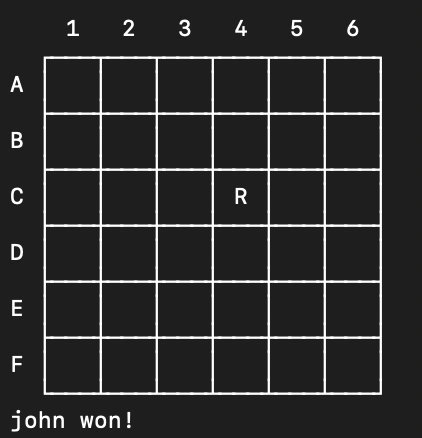

# Clusterfuss_5

## Identication

### Group

- Clusterfuss_5

### Members

- Bruno Miguel Lopes da Rocha Fernandes (up202108871)
- Vasco Moutinho de Oliveira (up202108881)

### Contribution

- Bruno Miguel Lopes da Rocha Fernandes (up202108871) - 50%
- Vasco Moutinho de Oliveira (up202108881) - 50%

### Game

The game we chose to implement was Clusterfuss, by Mark Steere.

## Installation and Execution

To install the game, you must first extract all files from the *PFL_TP1_T05_Clusterfuss5.zip* file.

Then, you have to open Sicstus Prolog or other Prolog interpreter. For Sicstus Prolog, if you are in Windows, you must open the Sicstus Prolog application, and then click on *File* > *Working Directory* and choose the *src* file inside the extracted folder. If you are in Linux, you must open the terminal, go to the *src* directory inside the extracted folder and run `sicstus -l clusterfuss.pl`.

After that, you must consult the file *clusterfuss.pl* that is inside the *src* directory running `consult(clusterfuss).`, and then run the command `play.`. The game will then start.

***Note***: If you are using Sicstus Prolog on Windows, consider changing the font to a terminal font (like Lucida Console), to improve the visualization of the game.

## Game Description

Clusterfuss was designed in July 2023 by Mark Steere.

Clusterfuss is a two-player game played on a square board of any size. In our implementation of the game, the player can choose to play in boards of 4x4, 6x6, or 8x8. The game starts with the board full of Red and Blue pieces. The two players take turns moving their own pieces, one per turn, starting with Red.

### Objective

The objective of the game is to remove all enemy checkers from the board. A player wins when the opponent has no pieces left on the board.

### Rules

The rules of the game are the following:

- Players take turns moving their own pieces, one per turn, starting with Red.
- Every move must be a piece capture. This means that a piece must be moved to a square occupied by an enemy or friendly piece, and the piece that was there is removed from the board.
- Pieces can only move orthogonally (up, down, left or right), and one square in each turn.
- After a piece is moved, if it has split the board in multiple groups, all groups that are not connected to the square where the piece was moved are removed from the board.
- A move is only valid if it does not result in a removal of a group that has friendly pieces.

In the official game rulebook, it is stated that when a player has no available moves their turn is skipped. We did not implement this feature, because we found it to be unnecessary, since the player can **always** make a move.

#### Example

### Groups

All groups are comprised of checkers ortogonally interconnected. Diagonal adjacencies are irrelevant in Clusterfuss. Groups may contain checkers of either or both colors. At the conclusion of each turn, there must exist only one group on the board.

### Official Game Rules

The oficial game rules are in the *[clusterfuss.pdf](clusterfuss.pdf)* file.

## Game Logic

### Internal Game State Representation

In our implementation, the internal game state is represented by the current player and the board. The board is represented with a list of lists, each list representing a row. Each element of the list is a piece, represented by red, blue, or empty. The current player is represented by player1 or player2. The game mode, board size, and each computer's difficulty are stored in separate predicates `game_mode(Mode)`, `board_size(Size)`, `level(Player, Level)`, respectively. The game mode can be either player vs player, player vs computer, or computer vs computer, represented by 1, 2, 3, 4, respectively. The board size can be 4x4, 6x6, or 8x8, represented by 4, 6, 8 respectively. The computer's difficulty can be Random Move or Best Move (Greedy) represented by 1 and 2, respectively.
All this configuration is done by the predicate `config(-GameState)`.

### Game State Visualization

The game state is created by the predicate `initial_state(+Size, -GameState)`.

The predicate `game(+GameState, +Mode)` is the game cycle.

The game state is visualized by printing the board and the current player. This is done by the predicate `display_game(+GameState)`. This predicate calls the predicates `display_board(+Size, +Board)` and `display_turn(+Player)`.

The look of this visualization is the following:

**Figure 1** - Game State Visualization

Then depending on the game mode, the game either asks the human player for a move, validates it and executes it (`get_move(-Move)`, `move(+GameState, +Move, -NewGameState)`), or makes the computer player choose a move `choose_move(+GameState, +Player, +Level, -Move)`. If the human player chooses an invalid move, the game displays a message saying that the chosen move is invalid and asks for another move.

### Move Validation and Execution

The move validation and execution is realized by the predicate `move(+GameState, +Move, -NewGameState)`.
This predicate works in different ways for computer players and human players.

For computer players, the predicate `choose_move(+GameState, +Player, +Level, -Move)`, and the move is chosen from the list of valid moves calculated by the predicate `valid_moves(+GameState, +Player, -ListOfMoves)`. If the Level is 1 (Random), then the move is chosen randomly from the list of valid moves. If the Level is 2 (Best), then it runs the predicate `minimax(+GameState, -BestMove)` , which chooses the move that generates the game state with the highest value for the player, using the Minimax algorithm. If there are multiple moves with the same value, the move is chosen randomly from those moves.

For human players, the predicate `valid_move(+GameState, +MoveIndexes, -NewGameState)` is called to validate the move. It returns NewGameState, because to verify if the move is valid, it generates the new board and checks if the board is valid, so for efficiency purposes, it returns the new state.

**Figure 2** - Move Validation and Invalid Move Message

### List of Valid Moves

The list of valid moves is generated by the predicate `valid_moves(+GameState, +Player, -ListOfMoves)` which returns a list of moves. Each element in the list has the 4 move indexes and the board that that move would generate (`[RowIndex, ColumnIndex, NewRowIndex, NewColumnIndex, NewBoard]`). This predicate is used by the computer player to choose a move.

### End of Game

The end of the game is verified by the predicate `game_over(+GameState, -Winner)` that checks if the player that is playing next has no pieces left on the board. If that is the case, the Winner is the opponent.

Here is the end of game message:

**Figure 2** - End of Game

### Game State Evaluation

The game state evaluation is done by the predicate `value(+GameState, +Player, -Value)`. This predicate returns the value of the game state for the player. The value is calculated by the number of pieces the player has on the board minus the number of pieces the opponent has on the board. This predicate is used by the computer player to choose the best move. If the GameState is a final state, the value is 1000.

### Computer Plays

The computer plays are done by the predicate `choose_move(+GameState, +Player, +Level, -Move)`. This predicate chooses the move depending on the level of the player. If the level is 1, the move is chosen by randomly selecting a move from the list of valid moves generated by `valid_moves(+GameState, +Player, -ListOfMoves)`. If the level is 2, the move is chosen by the predicate `best_move(+GameState, +Player, -Move)` which chooses the move that generates the game state with the highest value for the player, using the Minimax algorithm.

## Conclusions

The work was very well distributed between the two members of the group. We both worked on the implementation of the game, and we both worked on the report. We had some problems with the implementation of the game, but, fortunately, we were able to solve them all and we are satisfied with the result.

### Known Issues

We found no issues with our implementation.

### Future Improvements

- Implement a better AI, that uses the Minimax algorithm with Alpha-Beta pruning, to improve the performance of the AI.
- Optimize the generation of the list of valid moves, to improve the performance of the AI.
- Implement a better visualization of the game, with a graphical interface.

## Bibliography

- Clusterfuss (*[clusterfuss.pdf](clusterfuss.pdf)*)
- Prolog Documentation (<https://www.swi-prolog.org/>)
